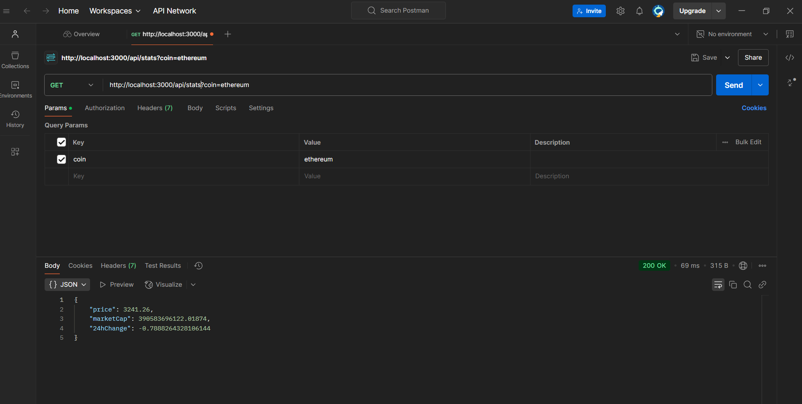
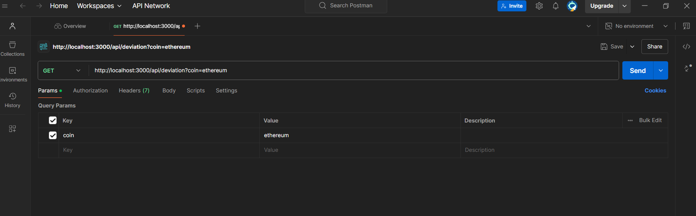

# 🚀 Cryptocurrency Price Tracker

A real-time cryptocurrency tracking system that monitors Bitcoin, Ethereum, and Matic prices using Node.js and MongoDB.

## 📋 Table of Contents
- [Features](#features)
- [Tech Stack](#tech-stack)
- [API Screenshots](#api-screenshots)
- [Directory Structure](#directory-structure)
- [Installation](#installation)
- [API Documentation](#api-documentation)
- [Testing Guide](#testing-guide)
- [Deployment](#deployment)

## ✨ Features
- 🔄 Automatic price updates every 2 hours
- 📊 Real-time cryptocurrency statistics
- 📈 Price deviation calculations
- 🗄️ MongoDB data persistence
- ⚡ Fast and reliable API endpoints

## 💻 Tech Stack
- Node.js
- Express.js
- MongoDB
- node-cron
- axios
- Postman (for testing)

## 📸 API Screenshots

### Stats API Response

*GET /api/stats endpoint showing price, market cap, and 24h change*

### Deviation API Response

*GET /api/deviation endpoint showing standard deviation calculation*

## 📁 Directory Structure
```
crypto-tracker/
│
├── controllers/
│   └── cryptoController.js     # API endpoint handlers
│
├── models/
│   └── Crypto.js              # MongoDB schema definition
│
├── routes/
│   ├── stats.js               # Stats API routes
│   └── deviation.js           # Deviation API routes
│
├── jobs/
│   └── cryptoJob.js           # Background job for data fetching
│
├── images/                    # Screenshots and images
│   ├── stats.png             # Stats API screenshot
│   └── deviation.png         # Deviation API screenshot
│
├── .env                      # Environment variables
├── .gitignore               # Git ignore file
├── package.json             # Project dependencies
└── server.js                # Main application file
```

## 🛠️ Installation

1. **Clone the repository**
```bash
git clone https://github.com/your-username/crypto-tracker.git
cd crypto-tracker
```

2. **Install dependencies**
```bash
npm install
```

3. **Setup environment variables**
Create a `.env` file in the root directory:
```env
PORT=3000
MONGO_URI=your_mongodb_connection_string
```

4. **Start the server**
```bash
# Development
npm run dev

# Production
npm start
```

## 📡 API Documentation

### 1. Get Cryptocurrency Stats
```http
GET /api/stats?coin={coinId}
```

**Parameters:**
| Name | Type | Description |
|------|------|-------------|
| coin | string | Cryptocurrency ID (bitcoin/ethereum/matic-network) |

**Response:**
```json
{
    "price": 40000,
    "marketCap": 800000000,
    "24hChange": 3.4
}
```

### 2. Get Price Deviation
```http
GET /api/deviation?coin={coinId}
```

**Parameters:**
| Name | Type | Description |
|------|------|-------------|
| coin | string | Cryptocurrency ID (bitcoin/ethereum/matic-network) |

**Response:**
```json
{
    "deviation": 4082.48
}
```

## 🧪 Testing Guide

### Prerequisites
- Postman installed
- Server running locally or deployed
- MongoDB connection established

### Using Postman

1. **Testing Stats API**
   - Open Postman
   - Create new GET request to `http://localhost:3000/api/stats?coin=bitcoin`
   - Send request and verify response format matches screenshot above

2. **Testing Deviation API**
   - Create new GET request to `http://localhost:3000/api/deviation?coin=bitcoin`
   - Send request and verify response format matches screenshot above

### Using cURL

```bash
# Test Stats API
curl "http://localhost:3000/api/stats?coin=bitcoin"

# Test Deviation API
curl "http://localhost:3000/api/deviation?coin=bitcoin"
```

## 🚀 Deployment

### MongoDB Atlas Setup
1. Create MongoDB Atlas account
2. Create new cluster
3. Get connection string
4. Update MONGO_URI in .env

### Deploying to Heroku
1. Install Heroku CLI
2. Login to Heroku
```bash
heroku login
```
3. Create Heroku app
```bash
heroku create your-app-name
```
4. Set environment variables
```bash
heroku config:set MONGO_URI=your_mongodb_uri
```
5. Deploy
```bash
git push heroku main
```

## 📝 Testing Checklist

### Stats API
- [ ] Returns correct price data
- [ ] Handles invalid coin parameter
- [ ] Returns proper error messages
- [ ] Response time < 1000ms

### Deviation API
- [ ] Calculates correct deviation
- [ ] Uses last 100 records
- [ ] Handles missing data gracefully
- [ ] Returns proper error format

### Background Job
- [ ] Runs every 2 hours
- [ ] Updates database successfully
- [ ] No duplicate entries
- [ ] Error handling works

## 🤝 Contributing

1. Fork the repository
2. Create feature branch
```bash
git checkout -b feature/your-feature
```
3. Commit changes
```bash
git commit -m "Add your feature"
```
4. Push to branch
```bash
git push origin feature/your-feature
```
5. Create Pull Request

## 📦 Dependencies

```json
{
  "dependencies": {
    "axios": "^1.6.2",
    "dotenv": "^16.3.1",
    "express": "^4.18.2",
    "mongoose": "^8.0.3",
    "node-cron": "^3.0.3"
  },
  "devDependencies": {
    "nodemon": "^3.0.2"
  }
}
```

## 📄 License

This project is MIT licensed.

---
Made with ❤️ for KoinX Backend Internship Assignment